# Swiggy Clone — GitOps CI/CD on AWS EKS

[](https://www.terraform.io/)
[](https://aws.amazon.com/eks/)
[](https://argoproj.github.io/cd/)
[](https://www.jenkins.io/)
[](https://react.dev/)
[](https://www.docker.com/)
[](https://aws.amazon.com/)

A **production-grade DevOps project** deploying a Swiggy food delivery clone (React 18) to **AWS EKS** using **GitOps** with ArgoCD, **Jenkins CI/CD**, and **Terraform IaC** — featuring full monitoring, security scanning, and multi-environment support.

---

## Table of Contents

- [Overview](#overview)
- [Architecture](#architecture)
- [Tech Stack](#tech-stack)
- [Project Structure](#project-structure)
- [Prerequisites](#prerequisites)
- [Quick Start](#quick-start)
  - [1. Create S3 Backends for Terraform State](#1-create-s3-backends-for-terraform-state)
  - [2. Provision VPC & EC2 Jumphost](#2-provision-vpc--ec2-jumphost)
  - [3. Deploy EKS Cluster via Jenkins](#3-deploy-eks-cluster-via-jenkins)
  - [4. Create ECR Repository](#4-create-ecr-repository)
  - [5. Run the Application CI Pipeline](#5-run-the-application-ci-pipeline)
  - [6. Install & Configure ArgoCD](#6-install--configure-argocd)
  - [7. Set Up Monitoring](#7-set-up-monitoring)
- [CI/CD Pipeline Details](#cicd-pipeline-details)
  - [Application Pipeline (Jenkinsfile.app)](#application-pipeline-jenkinsfileapp)
  - [Infrastructure Pipeline (Jenkinsfile.infra)](#infrastructure-pipeline-jenkinsfileinfra)
- [Infrastructure as Code (Terraform)](#infrastructure-as-code-terraform)
  - [Terraform Modules](#terraform-modules)
  - [Multi-Environment Support](#multi-environment-support)
- [GitOps with ArgoCD](#gitops-with-argocd)
  - [App-of-Apps Pattern](#app-of-apps-pattern)
  - [Managed Applications](#managed-applications)
- [Kubernetes Manifests](#kubernetes-manifests)
- [Monitoring & Observability](#monitoring--observability)
  - [Prometheus](#prometheus)
  - [Grafana Dashboards](#grafana-dashboards)
- [Security](#security)
  - [Vulnerability Scanning](#vulnerability-scanning)
  - [Cluster Policies (Kyverno)](#cluster-policies-kyverno)
- [Databases](#databases)
- [EC2 Jumphost & Pre-installed Tools](#ec2-jumphost--pre-installed-tools)
- [Cleanup / Tear Down](#cleanup--tear-down)
- [Documentation](#documentation)
- [Contributing](#contributing)
- [License](#license)

---

## Overview

This project demonstrates a **complete end-to-end DevOps pipeline** for deploying a Swiggy food delivery clone application. It covers:

- **Infrastructure provisioning** with Terraform (VPC, EKS, ECR, EC2, S3)
- **Continuous Integration** with Jenkins (build, test, scan, push)
- **Continuous Deployment** with ArgoCD using the GitOps methodology
- **Container orchestration** on AWS EKS (Elastic Kubernetes Service)
- **Monitoring & observability** with Prometheus and Grafana (9 pre-built dashboards)
- **Security scanning** with Trivy (filesystem + container image), OWASP Dependency-Check, and SonarQube
- **Policy enforcement** with Kyverno cluster policies
- **Multi-environment** support (dev, staging, prod)

---

## Architecture

### High-Level System Architecture

The end-to-end flow from code commit to production deployment:


---

### AWS Infrastructure Architecture

Terraform-provisioned infrastructure in `us-east-1`:

```mermaid
flowchart TB
    subgraph AWS["☁️ AWS Cloud — us-east-1"]
        subgraph S3["S3"]
            S3A[("swiggy-gitops-tfstate<br/>Terraform State")]
        end

        subgraph VPC["VPC · 10.0.0.0/16"]
            subgraph AZ1["AZ: us-east-1a"]
                PUB1["Public Subnet<br/>10.0.1.0/24"]
                PRIV1["Private Subnet<br/>10.0.2.0/24"]
            end
            subgraph AZ2["AZ: us-east-1b"]
                PUB2["Public Subnet<br/>10.0.0.0/24"]
                PRIV2["Private Subnet<br/>10.0.3.0/24"]
            end

            IGW["Internet<br/>Gateway"]

            subgraph EC2["EC2 Jumphost"]
                JH["Jenkins · SonarQube<br/>Docker · kubectl · Helm<br/>Terraform · Trivy<br/>+ 20 DevOps Tools"]
            end

            subgraph EKSCLUSTER["EKS Cluster"]
                CP["EKS Control Plane<br/>Master IAM Role"]
                NG["Worker Node Group<br/>Worker IAM Role<br/>Autoscaler Policy"]
            end
        end

        subgraph ECR2["ECR"]
            REPO["swiggy repo<br/>Scan-on-Push · AES256"]
        end
    end

    IGW --- PUB1
    IGW --- PUB2
    PUB1 --- EC2
    PUB1 --- EKSCLUSTER
    PRIV1 --- NG
    PRIV2 --- NG

    style AWS fill:#fff9c4,stroke:#f9a825
    style VPC fill:#e3f2fd,stroke:#1565c0
    style AZ1 fill:#e8eaf6,stroke:#3949ab
    style AZ2 fill:#e8eaf6,stroke:#3949ab
    style EKSCLUSTER fill:#e1f5fe,stroke:#0277bd
    style EC2 fill:#fff3e0,stroke:#ef6c00
    style ECR2 fill:#e8f5e9,stroke:#2e7d32
    style S3 fill:#f3e5f5,stroke:#7b1fa2
```



---

### CI/CD Pipeline Flow

#### Application Pipeline (`Jenkinsfile.app`) — 11 Stages

```mermaid
flowchart TB
    START((Trigger)) --> S1

    subgraph PREP["🔧 Preparation"]
        S1["1. Clean<br/>Workspace"] --> S2["2. Checkout<br/>from Git"]
    end

    subgraph QUALITY["🔍 Code Quality & Security"]
        S3["3. SonarQube<br/>Analysis"] --> S4["4. Quality<br/>Gate Check"]
        S4 --> S5["5. Install npm<br/>Dependencies"]
        S5 --> S6["6. OWASP<br/>Dependency-Check"]
        S6 --> S7["7. Trivy<br/>Filesystem Scan"]
    end

    subgraph BUILD["📦 Build & Push"]
        S8["8. Docker<br/>Image Build"] --> S9["9. Push Image<br/>to AWS ECR"]
        S9 --> S10["10. Trivy<br/>Image Scan"]
    end

    subgraph DEPLOY["🚀 Deploy"]
        S11["11. Update<br/>deployment.yaml<br/>&lpar;git push&rpar;"]
    end

    subgraph POST["📧 Post-Build"]
        S12["Email Notification<br/>+ Trivy & OWASP<br/>Reports Attached"]
    end

    S2 --> S3
    S7 --> S8
    S10 --> S11
    S11 --> S12

    style PREP fill:#e8eaf6,stroke:#3949ab
    style QUALITY fill:#fff3e0,stroke:#ef6c00
    style BUILD fill:#e8f5e9,stroke:#2e7d32
    style DEPLOY fill:#fce4ec,stroke:#c62828
    style POST fill:#f3e5f5,stroke:#7b1fa2
```



#### Infrastructure Pipeline (`Jenkinsfile.infra`)

```mermaid
flowchart LR
    P["Parameter:<br/>apply / destroy"]
    P --> I1["Checkout"] --> I2["TF Version"] --> I3["TF Init"] --> I4["TF Validate"] --> I5["TF Plan"]
    I5 -->|apply| I6A["TF Apply ✅"]
    I5 -->|destroy| I6B["TF Destroy 🗑️"]

    style P fill:#fff3e0,stroke:#ef6c00
    style I6A fill:#e8f5e9,stroke:#2e7d32
    style I6B fill:#ffebee,stroke:#c62828
```



---

### GitOps Workflow with ArgoCD

How ArgoCD implements continuous deployment using the App-of-Apps pattern:

```mermaid
flowchart TB
    subgraph REPO["GitHub Repository"]
        direction TB
        ROOT["gitops/argocd/<br/>root-app.yaml"]
        APPS["gitops/apps/"]
        SW["swiggy/<br/>deployment.yaml<br/>service.yaml<br/>ingress.yaml"]
        MON["monitoring/<br/>prometheus.yaml<br/>grafana.yaml"]
        DB["databases/<br/>mariadb.yaml<br/>postgres.yaml"]
        APPS --- SW
        APPS --- MON
        APPS --- DB
    end

    subgraph ARGOCD["ArgoCD Controller"]
        direction TB
        SYNC["Auto-Sync Engine<br/>━━━━━━━━━━━━━━━<br/>✓ Prune: true<br/>✓ Self-Heal: true"]
        PROJ["Project:<br/>swiggy-gitops"]
    end

    subgraph EKS2["AWS EKS Cluster"]
        subgraph NS_DEFAULT["namespace: default"]
            APP2["Swiggy App<br/>4 replicas · port 3000"]
            MDB["MariaDB 10.11<br/>port 3306"]
            PG["PostgreSQL 15<br/>port 5432"]
        end
        subgraph NS_PROM["namespace: prometheus"]
            PROM2["Prometheus<br/>kube-prometheus-stack"]
            GRAF2["Grafana<br/>9 dashboards"]
        end
        subgraph NS_ARGO["namespace: argocd"]
            ARGO2["ArgoCD Server"]
        end
    end

    ROOT -->|"manages"| SYNC
    SYNC -->|"watches & recurse"| APPS
    SYNC -->|"deploys"| NS_DEFAULT
    SYNC -->|"deploys"| NS_PROM
    PROJ -.->|"scoped"| SYNC

    style REPO fill:#f3e5f5,stroke:#7b1fa2
    style ARGOCD fill:#fce4ec,stroke:#c62828
    style EKS2 fill:#e3f2fd,stroke:#1565c0
    style NS_DEFAULT fill:#e8f5e9,stroke:#2e7d32
    style NS_PROM fill:#fff3e0,stroke:#ef6c00
    style NS_ARGO fill:#fce4ec,stroke:#c62828
```



---

### Kubernetes Cluster Architecture

Workloads and networking inside the EKS cluster:

```mermaid
flowchart TB
    INET["🌐 Internet"] -->|"swiggy.example.com"| ING

    subgraph EKS3["AWS EKS Cluster"]
        ING["Nginx Ingress<br/>Controller"]
        
        subgraph SVC["Services"]
            SVC_APP["swiggy-app<br/>LoadBalancer<br/>:80 → :3000"]
            SVC_MDB["mariadb-svc<br/>ClusterIP<br/>:3306"]
            SVC_PG["postgres-svc<br/>ClusterIP<br/>:5432"]
        end

        subgraph PODS["Pods"]
            direction TB
            P1["swiggy-app<br/>replica 1"]
            P2["swiggy-app<br/>replica 2"]
            P3["swiggy-app<br/>replica 3"]
            P4["swiggy-app<br/>replica 4"]
            PM["mariadb<br/>pod"]
            PP["postgresql<br/>pod"]
        end

        subgraph STORAGE["Persistent Storage"]
            PVC1[("mariadb-pvc")]
            PVC2[("postgres-pvc")]
        end

        subgraph SECRETS["Secrets"]
            SEC1["mariadb-secret"]
            SEC2["postgres-secret"]
        end
    end

    ING --> SVC_APP
    SVC_APP --> P1 & P2 & P3 & P4
    SVC_MDB --> PM
    SVC_PG --> PP
    PM --- PVC1
    PP --- PVC2
    PM -.- SEC1
    PP -.- SEC2

    style EKS3 fill:#e3f2fd,stroke:#1565c0
    style SVC fill:#e8eaf6,stroke:#3949ab
    style PODS fill:#e8f5e9,stroke:#2e7d32
    style STORAGE fill:#fff3e0,stroke:#ef6c00
    style SECRETS fill:#fce4ec,stroke:#c62828
```



---

### Monitoring & Security Architecture

```mermaid
flowchart TB
    subgraph MONITORING["📊 Monitoring Stack"]
        direction TB
        PROM3["Prometheus<br/>kube-prometheus-stack<br/>Retention: 15d<br/>CPU: 200m–500m<br/>Mem: 512Mi–1Gi"]
        GRAF3["Grafana<br/>9 Pre-built Dashboards"]
        LOKI["Loki<br/>Log Aggregation"]
        
        PROM3 -->|"datasource<br/>:9090"| GRAF3
        LOKI -->|"datasource<br/>:3100"| GRAF3
    end

    subgraph DASHBOARDS["📈 Grafana Dashboards"]
        direction TB
        D1["315 · K8s Cluster"]
        D2["1621 · Deployments"]
        D3["3662 · Prometheus 2.0"]
        D4["6417 · K8s via Prometheus"]
        D5["9614 · NGINX Ingress"]
        D6["10000 · Cluster Monitoring"]
        D7["12006 · API Server"]
        D8["13602 · K8s Networking"]
        D9["15758 · Global Views"]
    end

    subgraph SECURITY["🔒 Security Stack"]
        direction TB
        SQ["SonarQube<br/>Static Analysis"]
        OWASP["OWASP Dep-Check<br/>CVE Scanning"]
        TRIV["Trivy<br/>FS + Image Scan<br/>CRITICAL / HIGH / MEDIUM"]
        ECRSCAN["ECR Scan-on-Push<br/>Auto Image Scan"]
        KYV["Kyverno Policies"]
        
        subgraph POLICIES["Cluster Policies"]
            KP1["require-resource-limits<br/>CPU & Memory required"]
            KP2["restrict-image-registries<br/>ECR only *.dkr.ecr.*.amazonaws.com"]
        end
        KYV --> POLICIES
    end

    GRAF3 --> DASHBOARDS

    style MONITORING fill:#e8f5e9,stroke:#2e7d32
    style DASHBOARDS fill:#fff3e0,stroke:#ef6c00
    style SECURITY fill:#ffebee,stroke:#c62828
    style POLICIES fill:#fce4ec,stroke:#c62828
```



---

### Terraform Module Dependency Graph


> See [docs/README.md](docs/README.md) for additional architecture details.

---

## Tech Stack

| Category              | Technology                                      |
|-----------------------|-------------------------------------------------|
| **Application**       | React 18, Bootstrap 5, Node.js 16               |
| **Containerization**  | Docker (multi-stage), AWS ECR                    |
| **Orchestration**     | Kubernetes (AWS EKS)                             |
| **IaC**               | Terraform >= 1.6.3                               |
| **CI/CD**             | Jenkins (Declarative Pipelines)                  |
| **GitOps**            | ArgoCD (App-of-Apps pattern)                     |
| **Monitoring**        | Prometheus (kube-prometheus-stack), Grafana       |
| **Code Quality**      | SonarQube (LTS Community)                        |
| **Security Scanning** | Trivy (fs + image), OWASP Dependency-Check       |
| **Policy Engine**     | Kyverno (ClusterPolicies)                        |
| **Databases**         | MariaDB 10.11, PostgreSQL 15                     |
| **DNS (Optional)**    | AWS Route 53                                     |
| **Cloud Provider**    | AWS (VPC, EKS, ECR, EC2, S3, IAM, Route 53)     |

---

## Project Structure

```
swiggy-gitops/
│
├── README.md                              # This file
├── docs/                                  # Documentation & guides
│   ├── README.md                          #   Architecture diagrams
│   ├── steps.md                           #   20-step deployment walkthrough
│   └── tools-verification.md              #   Tool installation checklist
│
├── app/                                   # Application Source Code
│   └── swiggy-react/
│       ├── Dockerfile                     #   Docker build (node:16-slim)
│       ├── package.json                   #   React 18 + Bootstrap 5
│       ├── public/
│       │   └── index.html
│       └── src/
│           ├── App.js                     #   Root component
│           ├── App.css
│           ├── index.js                   #   Entry point
│           └── Components/
│               ├── Navigate.jsx           #   Navigation bar
│               ├── OffersBanner.jsx       #   Offers & deals carousel
│               ├── BestRest.jsx           #   Best restaurants section
│               ├── RestaurentChain.jsx    #   Restaurant chain listings
│               ├── RestaurentOnline.jsx   #   Online ordering section
│               └── Footer.jsx            #   Footer component
│
├── infrastructure/                        # Terraform (IaC)
│   ├── environments/                      #   Multi-env configurations
│   │   ├── dev/main.tf                    #     Development
│   │   ├── staging/main.tf                #     Staging
│   │   └── prod/main.tf                   #     Production
│   └── modules/                           #   Reusable TF modules
│       ├── vpc/                           #     VPC, Subnets, IGW, Routes
│       ├── eks/                           #     EKS Cluster + Node Groups
│       ├── ecr/                           #     ECR Repository (scan-on-push)
│       ├── ec2-jumphost/                  #     EC2 with all DevOps tools
│       │   ├── main.tf
│       │   ├── install-tools.sh           #       User-data script (20+ tools)
│       │   ├── kubernetes.sh
│       │   ├── iam-role.tf
│       │   ├── iam-policy.tf
│       │   └── iam-instance-profile.tf
│       └── s3-backend/                    #     Remote TF state storage
│
├── gitops/                                # ArgoCD watches THIS directory
│   ├── apps/
│   │   ├── swiggy/
│   │   │   ├── deployment.yaml            #     4-replica deployment
│   │   │   ├── service.yaml               #     LoadBalancer service
│   │   │   └── ingress.yaml               #     Nginx ingress rules
│   │   ├── monitoring/
│   │   │   ├── prometheus.yaml            #     Prometheus Helm app
│   │   │   └── grafana.yaml               #     Grafana Helm app
│   │   └── databases/
│   │       ├── mariadb.yaml               #     MariaDB deployment
│   │       └── postgres.yaml              #     PostgreSQL deployment
│   └── argocd/
│       ├── root-app.yaml                  #     App-of-apps root (auto-sync)
│       └── projects.yaml                  #     ArgoCD project definition
│
├── ci/                                    # Jenkins CI Pipelines
│   ├── Jenkinsfile.app                    #     App build/scan/push/deploy
│   └── Jenkinsfile.infra                  #     Terraform apply/destroy
│
├── monitoring/                            # Monitoring Configuration
│   └── grafana-dashboards/
│       ├── dashboards/                    #     9 pre-built JSON dashboards
│       │   ├── 315_revlatest.json
│       │   ├── 1621_revlatest.json
│       │   ├── 3662_revlatest.json
│       │   ├── 6417_revlatest.json
│       │   ├── 9614_revlatest.json
│       │   ├── 10000_revlatest.json
│       │   ├── 12006_revlatest.json
│       │   ├── 13602_revlatest.json
│       │   └── 15758_revlatest.json
│       └── datasources/
│           └── datasources.yaml           #     Prometheus + Loki sources
│
└── security/                              # Security & Compliance
    ├── trivy-config.yaml                  #     Trivy scan configuration
    └── policies/
        └── cluster-policies.yaml          #     Kyverno policies
```

---

## Prerequisites

| Requirement              | Details                                                          |
|--------------------------|------------------------------------------------------------------|
| **AWS Account**          | With IAM permissions for EC2, EKS, ECR, S3, VPC, Route 53       |
| **AWS CLI v2**           | Installed and configured (`aws configure`)                       |
| **Terraform**            | >= 1.6.3                                                         |
| **Git**                  | Installed locally                                                |
| **SSH Key Pair**         | Created in your target AWS region (e.g., `us-east-1`)           |
| **GitHub PAT**           | Personal Access Token for Jenkins to push manifest updates       |
| **Domain (optional)**    | For Route 53 DNS setup                                          |

> **Note:** All other tools (Jenkins, Docker, kubectl, Helm, eksctl, Trivy, SonarQube, etc.) are **automatically installed** on the EC2 jumphost via the user-data script.

---

## Quick Start

### 1. Create S3 Backends for Terraform State

```bash
git clone https://github.com/khushalbhavsar/Swiggy-Gitops-EKS.git
cd Swiggy-Gitops-EKS

cd infrastructure/modules/s3-backend
terraform init
terraform plan
terraform apply -auto-approve
```

This creates two S3 buckets for storing remote Terraform state files.

### 2. Provision VPC & EC2 Jumphost

```bash
cd infrastructure/modules/ec2-jumphost
terraform init
terraform plan
terraform apply -auto-approve
```

This provisions:
- **VPC** with public/private subnets across 2 AZs (`us-east-1a`, `us-east-1b`), Internet Gateway, and route tables
- **EC2 jumphost** (30 GB root volume) with 20+ DevOps tools pre-installed via user-data
- **IAM roles & policies** for EC2/EKS access
- **Security groups** for SSH, Jenkins (8080), SonarQube (9000)

Save the output `jumphost_public_ip` — you'll use it for Jenkins, SonarQube, and SSH.

### 3. Deploy EKS Cluster via Jenkins

Navigate to Jenkins at `http://<jumphost_public_ip>:8080` and run the **Jenkinsfile.infra** pipeline:

```
Pipeline: Jenkinsfile.infra
Parameter: ACTION = apply
```

This runs `terraform init → validate → plan → apply` against the EKS module, creating:
- EKS control plane with master IAM role (AmazonEKSClusterPolicy, AmazonEKSServicePolicy, AmazonEKSVPCResourceController)
- Worker node group with IAM role (AmazonEKSWorkerNodePolicy, AmazonEKS_CNI_Policy, AmazonEC2ContainerRegistryReadOnly, AmazonSSMManagedInstanceCore)
- Cluster autoscaler IAM policy

### 4. Create ECR Repository

The ECR module creates a repository named `swiggy` with:
- **Scan-on-push** enabled for automatic vulnerability detection
- **AES256 encryption**
- **Force delete** enabled for clean teardown

### 5. Run the Application CI Pipeline

Trigger the **Jenkinsfile.app** pipeline in Jenkins. See [CI/CD Pipeline Details](#cicd-pipeline-details) for the full stage breakdown.

### 6. Install & Configure ArgoCD

```bash
kubectl create namespace argocd
kubectl apply -n argocd -f https://raw.githubusercontent.com/argoproj/argo-cd/stable/manifests/install.yaml

# Get ArgoCD admin password
kubectl -n argocd get secret argocd-initial-admin-secret -o jsonpath="{.data.password}" | base64 -d

# Apply project & root app
kubectl apply -f gitops/argocd/projects.yaml
kubectl apply -f gitops/argocd/root-app.yaml
```

ArgoCD will auto-discover and deploy all applications under `gitops/apps/` using the App-of-Apps pattern.

### 7. Set Up Monitoring

Monitoring is automatically deployed by ArgoCD via the Helm chart manifests, or manually:

```bash
helm repo add prometheus-community https://prometheus-community.github.io/helm-charts
helm repo add grafana https://grafana.github.io/helm-charts
helm install prometheus prometheus-community/kube-prometheus-stack -n prometheus --create-namespace
helm install grafana grafana/grafana -n prometheus
```

Import the 9 pre-built dashboards from `monitoring/grafana-dashboards/dashboards/`.

---

## CI/CD Pipeline Details

### Application Pipeline (Jenkinsfile.app)

The main CI pipeline runs **10 stages** end-to-end:

| Stage                     | Description                                                           |
|---------------------------|-----------------------------------------------------------------------|
| **Cleaning Workspace**    | Cleans the Jenkins workspace for a fresh build                       |
| **Checkout from Git**     | Clones the `main` branch from GitHub                                 |
| **SonarQube Analysis**    | Runs static code analysis via SonarQube scanner                      |
| **Quality Gate**          | Waits for SonarQube quality gate result                              |
| **Install Dependencies**  | Runs `npm install` in `app/swiggy-react/`                            |
| **OWASP FS Scan**         | Runs OWASP Dependency-Check on the project filesystem                |
| **Trivy File Scan**       | Scans the filesystem for vulnerabilities, misconfigs, and secrets    |
| **Docker Image Build**    | Builds the Docker image from `app/swiggy-react/Dockerfile`          |
| **ECR Image Pushing**     | Tags and pushes the image to AWS ECR with build number tag           |
| **Trivy Image Scan**      | Scans the pushed Docker image for vulnerabilities                    |
| **Update Deployment File**| Updates `gitops/apps/swiggy/deployment.yaml` with the new image tag  |

**Post-build:** Sends an email notification with Trivy and OWASP reports attached.

**Pipeline flow:**

```
Code Push → Jenkins Trigger → SonarQube → OWASP + Trivy FS Scan
    → Docker Build → Push to ECR → Trivy Image Scan
    → Update deployment.yaml (git push) → ArgoCD Auto-Sync → EKS Deployment
```

### Infrastructure Pipeline (Jenkinsfile.infra)

A parameterized pipeline for Terraform operations:

| Parameter | Options              | Description                              |
|-----------|----------------------|------------------------------------------|
| `ACTION`  | `apply` / `destroy`  | Select Terraform action to perform       |

**Stages:** Checkout → Terraform Version → Init → Validate → Plan → Apply/Destroy

---

## Infrastructure as Code (Terraform)

### Terraform Modules

| Module           | Description                                                                   |
|------------------|-------------------------------------------------------------------------------|
| **vpc**          | VPC (`10.0.0.0/16`), 2 public + 2 private subnets, IGW, route tables, SGs   |
| **eks**          | EKS cluster with master/worker IAM roles, node groups, autoscaler policy      |
| **ecr**          | ECR repository (`swiggy`) with scan-on-push and AES256 encryption            |
| **ec2-jumphost** | EC2 instance with IAM profile, 30 GB volume, user-data installs 20+ tools    |
| **s3-backend**   | S3 buckets for remote Terraform state storage                                |

### Multi-Environment Support

Each environment (dev, staging, prod) references the shared modules:

```
infrastructure/environments/
├── dev/main.tf       # → modules/eks + modules/ecr
├── staging/main.tf   # → modules/eks + modules/ecr
└── prod/main.tf      # → modules/eks + modules/ecr
```

State is stored remotely in S3:

```hcl
backend "s3" {
  bucket = "swiggy-gitops-tfstate-843998948464"
  key    = "dev/terraform.tfstate"
  region = "us-east-1"
}
```

---

## GitOps with ArgoCD

### App-of-Apps Pattern

ArgoCD uses the **App-of-Apps** pattern with a single root application that recursively discovers all manifests under `gitops/apps/`:

```yaml
# root-app.yaml
spec:
  source:
    repoURL: https://github.com/khushalbhavsar/Swiggy-Gitops-EKS.git
    path: gitops/apps
    directory:
      recurse: true
  syncPolicy:
    automated:
      prune: true       # Remove resources not in Git
      selfHeal: true    # Auto-fix drift
```

### Managed Applications

| Application    | Type             | Namespace    | Description                         |
|----------------|------------------|--------------|-------------------------------------|
| **swiggy-app** | K8s Deployment   | default      | React app (4 replicas, port 3000)   |
| **prometheus** | Helm Chart       | prometheus   | kube-prometheus-stack monitoring     |
| **grafana**    | Helm Chart       | prometheus   | Grafana with Prometheus datasource   |
| **mariadb**    | K8s Deployment   | default      | MariaDB 10.11 (database: swiggy)    |
| **postgres**   | K8s Deployment   | default      | PostgreSQL 15 (database: swiggy)    |

---

## Kubernetes Manifests

### Swiggy App Deployment

- **Replicas:** 4
- **Image:** Pulled from AWS ECR (updated automatically by Jenkins)
- **Port:** 3000 (container) → 80 (service)
- **Service Type:** LoadBalancer
- **Ingress:** Nginx ingress controller at `swiggy.example.com`
- **Graceful Shutdown:** 300s termination grace period

### Service & Ingress

```yaml
# Service: LoadBalancer exposing port 80 → container port 3000
# Ingress: Nginx ingress at swiggy.example.com with rewrite-target
```

---

## Monitoring & Observability

### Prometheus

- Deployed via **kube-prometheus-stack** Helm chart
- **Retention:** 15 days
- **Resources:** 200m–500m CPU, 512Mi–1Gi memory
- Auto-managed by ArgoCD with self-healing

### Grafana Dashboards

9 pre-built dashboards included for comprehensive cluster monitoring:

| Dashboard ID | Description                          |
|--------------|--------------------------------------|
| 315          | Kubernetes cluster monitoring        |
| 1621         | Kubernetes deployment metrics        |
| 3662         | Prometheus 2.0 overview              |
| 6417         | Kubernetes cluster (Prometheus)      |
| 9614         | NGINX Ingress controller             |
| 10000        | Kubernetes cluster monitoring (via Prometheus) |
| 12006        | Kubernetes API server                |
| 13602        | Kubernetes / Networking / Cluster    |
| 15758        | Kubernetes / Views / Global          |

**Datasources configured:**
- **Prometheus** — `http://prometheus-kube-prometheus-prometheus.prometheus:9090`
- **Loki** — `http://loki.logging:3100` (for log aggregation)

---

## Security

### Vulnerability Scanning

| Tool                      | Scope                                  | Stage                    |
|---------------------------|----------------------------------------|--------------------------|
| **SonarQube**             | Static code analysis, code quality     | CI — SonarQube Analysis  |
| **OWASP Dependency-Check**| Known CVEs in npm dependencies         | CI — OWASP FS Scan       |
| **Trivy (filesystem)**    | Vulnerabilities, misconfigs, secrets   | CI — Trivy File Scan     |
| **Trivy (image)**         | Container image CVEs                   | CI — Trivy Image Scan    |
| **ECR Scan-on-Push**      | Automatic image scanning on push       | ECR Registry             |

**Trivy configuration** (`security/trivy-config.yaml`):
- Severity levels: CRITICAL, HIGH, MEDIUM
- Security checks: `vuln`, `config`, `secret`
- Terraform & Dockerfile misconfiguration checks enabled

### Cluster Policies (Kyverno)

Two enforced policies in `security/policies/cluster-policies.yaml`:

1. **`require-resource-limits`** — All containers must define CPU and memory limits
2. **`restrict-image-registries`** — Only images from the approved ECR registry (`*.dkr.ecr.*.amazonaws.com/*`) are allowed

---

## Databases

| Database        | Version | Port | Database Name | Storage               |
|-----------------|---------|------|---------------|-----------------------|
| **MariaDB**     | 10.11   | 3306 | swiggy        | PVC (mariadb-pvc)     |
| **PostgreSQL**  | 15      | 5432 | swiggy        | PVC (postgres-pvc)    |

Both databases:
- Use Kubernetes Secrets for credentials (`mariadb-secret`, `postgres-secret`)
- Are exposed as `ClusterIP` services (internal only)
- Use PersistentVolumeClaims for data durability

---

## EC2 Jumphost & Pre-installed Tools

The EC2 jumphost (provisioned via Terraform) auto-installs **20+ DevOps tools** via user-data script:

| Category                 | Tools                                              |
|--------------------------|----------------------------------------------------|
| **Source Control**       | Git                                                |
| **CI/CD**                | Jenkins, Maven, Docker, Docker Compose, SonarQube  |
| **IaC & Cloud**          | Terraform, AWS CLI v2, eksctl, kubectl, Helm 3     |
| **Security**             | Trivy, Vault                                       |
| **Databases**            | MariaDB, PostgreSQL 15                             |
| **Runtimes**             | Java 17 (Amazon Corretto), Node.js, npm            |
| **Configuration Mgmt**   | Ansible                                            |

> See [docs/tools-verification.md](docs/tools-verification.md) for the full verification checklist.

---

## Cleanup / Tear Down

### 1. Remove ArgoCD Applications

```bash
kubectl delete -f gitops/argocd/root-app.yaml
kubectl delete -f gitops/argocd/projects.yaml
kubectl delete namespace argocd
```

### 2. Destroy EKS Cluster

Run the **Jenkinsfile.infra** pipeline with `ACTION = destroy`, or manually:

```bash
cd infrastructure/environments/dev
terraform destroy -auto-approve
```

### 3. Destroy EC2 Jumphost & VPC

```bash
cd infrastructure/modules/ec2-jumphost
terraform destroy -auto-approve
```

### 4. Remove S3 State Buckets

```bash
cd infrastructure/modules/s3-backend
terraform destroy -auto-approve
```

---

## Documentation

| Document                                               | Description                              |
|--------------------------------------------------------|------------------------------------------|
| [docs/README.md](docs/README.md)                       | Architecture diagrams                    |
| [docs/steps.md](docs/steps.md)                         | Complete 20-step deployment walkthrough  |
| [docs/tools-verification.md](docs/tools-verification.md) | Tool installation verification checklist |

---

## Contributing

1. Fork the repository
2. Create a feature branch (`git checkout -b feature/my-feature`)
3. Commit your changes (`git commit -m 'Add my feature'`)
4. Push to the branch (`git push origin feature/my-feature`)
5. Open a Pull Request

---

## License

This project is open-source and available for educational and demonstration purposes.
